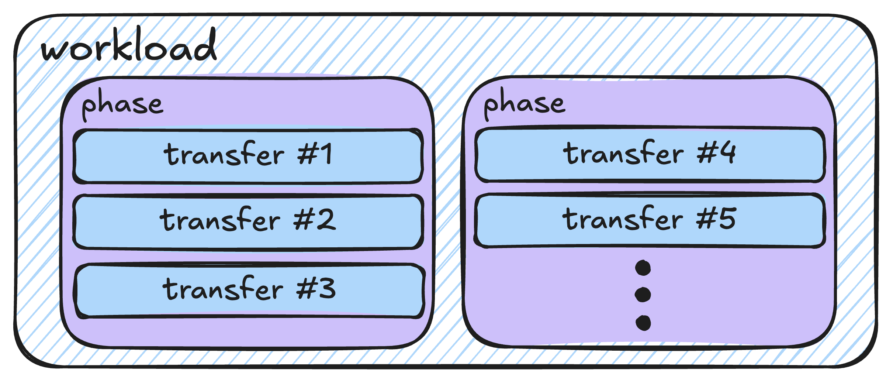

## tt-npe — Lightweight Network-on-Chip Performance Estimator

[](https://github.com/bgrady-tt/tt-npe/actions/workflows/build_and_test_ubuntu.yml)
[](https://github.com/bgrady-tt/tt-npe/actions/workflows/spdx.yml)
[](https://deepwiki.com/tenstorrent/tt-npe)

<div align="center">

<h1>

[Hardware](https://tenstorrent.com/cards/) | [Documentation](https://docs.tenstorrent.com/tt-npe/) | [Discord](https://discord.gg/tenstorrent) | [Join Us](https://boards.greenhouse.io/tenstorrent?gh_src=22e462047us) 

</h1>


<br>

**tt-npe** is a lightweight Network-on-Chip (NoC) Performance Estimator developed by Tenstorrent to simulate and analyze NoC workloads on Tensix-based devices. It supports profiling, visualization, and integration with tt-metal, enabling developers to optimize NoC communication performance through trace-driven or synthetic simulations. 

tt-npe supports wormhole_b0 and blackhole devices.

</div>

<br>

-----
# Quick Links
* [Getting Started](docs/src/getting_started.md)

-----
# What is this Repo? 
tt-npe simulates the behavior of an abstract NoC "workload" running on an simulated Tenstorrent device. A workload corresponds closely to a trace of all calls to the dataflow_api (i.e. `noc_async_read`, `noc_async_write`, ...). 

tt-npe can also act as a profiler/debugger for NoC traces, integrating with tt-metal profiler's device NoC trace capture feature and the ttnn-visualizer's new NPE mode. For more information, see the  [Profiler Mode](docs/src/getting_started.md#tt-npe-profiler-mode) section of the Getting Started page.

tt-npe can work with:
- Predefined workloads defined in files such as:
    - NoC trace JSON files extracted using tt-metal profiler's noc event capture feature
    - workload files with a simplified format more amenable to generation by other tools
- Programmatically constructed workloads using Python bindings

-----
# Related Tenstorrent Projects
- [tt-forge-fe](https://github.com/tenstorrent/tt-forge-fe)
- [tt-xla](https://github.com/tenstorrent/tt-xla)
- [tt-torch](https://github.com/tenstorrent/tt-torch)
- [tt-mlir](https://github.com/tenstorrent/tt-mlir)
- [tt-metalium](https://github.com/tenstorrent/tt-metal)
- [tt-tvm](https://github.com/tenstorrent/tt-tvm)

## Quick Start

#### Install 
```shell
git clone git@github.com:tenstorrent/tt-npe.git
cd tt-npe/ 
./build-npe.sh
```

#### Update
```shell
cd tt-npe/ && git pull && ./build-npe.sh
```

#### Setup

> [!NOTE]
> `ENV_SETUP` must be `source`'d **after** sourcing tt-metal Python virtualenv setup 

```shell
source ENV_SETUP
```
## tt-npe Profiler Mode 

#### tt-metal noc trace integration
tt_metal device profiler can collect detailed traces of all noc events for
analysis by tt-npe. This will work out of the box for _regular ttnn
models/ops_. Pure tt_metal executables must call
`tt::tt_metal::DumpDeviceProfileResults()`.

```shell
tt-metal/tools/tracy/profile_this.py --collect-noc-traces -c 'pytest command/to/trace.py' -o output_dir
```

tt-npe data should be automatically added to the ops perf report CSV in
`output_dir/reports/`. The new columns corresponding to tt-npe data are `'DRAM
BW UTIL'` and `'NOC UTIL'`.

Additionally, the raw noc traces are dumped to `output_dir/.logs/`, and can be
further analyzed without additional profiler runs.

See [noc trace format](https://github.com/tenstorrent/tt-npe/blob/main/tt_npe/doc/noc_trace_format.md) for more details on the format of the noc traces.

#### Generating visualizer timelines from noc traces using tt-npe

```shell
npe_analyze_noc_trace_dir.py my_output_directory/.logs/ -e
```

ttnn-visualizer JSON inputs are dumped to subdir `output_dir/npe_viz/`. Note
these simulation timeline files are _also JSON format files_, but different
than noc trace JSON.

See [ttnn-visualizer](https://github.com/tenstorrent/ttnn-visualizer/) for more
details on installation and use.

## API and Advanced Use

##### Install Dir Structure
Everything is installed to `tt-npe/install/`, including:
- Shared library (`install/lib/libtt_npe.so`)
- Headers C++ API (`install/include/`)
- Python CLI using pybind11 (`install/bin/tt_npe.py`)

### Unit Tests
tt-npe has two unit test suites; one for C++ code and one for Python.

##### Run All Tests

```
$ tt_npe/scripts/run_ut.sh # can be run from any pwd
```

### Simulating Predefined Workloads Using tt_npe.py 

#### Environment Setup
Run the following to add tt-npe install dir to your `$PATH`:

```shell
cd tt-npe/ 
source ENV_SETUP # add <tt_npe_root>/install/bin/ to $PATH 
```

Now run the following:
```shell
tt_npe.py -w tt_npe/workload/example_wl.json
```

**Note**: the `-w` argument is *required*, and specifies the JSON workload file to load.

##### Other Important Options

Bandwidth derating caused by congestion between concurrent transfers is
modelled **by default**. Congestion modelling can be *disabled* using
`--cong-model none`.

The `-e` option dumps detailed information about simulation timeline (e.g.
congestion and transfer state for each timestep) into a JSON file located at
`npe_timeline.json` (by default). Future work is to load this data into a
visualization tool, but it could be used for ad-hoc analysis as well.  

See `tt_npe.py --help` for more information about available options.

### DRAM Controller Congestion Modelling

By default tt-npe derates bandwidth per *link* and per *NIU* only. On both Wormhole and
Blackhole **three DRAM NIU coordinates share a single DRAM controller**, and NOC0 and NOC1
traffic to the same coordinate is tracked separately again, so a controller can be several
times oversubscribed while every individual NIU it sits behind still looks unsaturated.

The optional per-DRAM-controller model closes that gap. It is controlled by two options:

| Option | Config field | Default |
| --- | --- | --- |
| `--dram-controller-model {off,observe,enforce}` | `dram_controller_model` | `off` |
| `--dram-controller-capacity-scale <float>` | `dram_controller_capacity_scale` | `1.0` |

- **`off`** — no demand grid is allocated and every code path added by this feature is
  skipped. Predictions are bit-identical to a build without the feature. **This is the
  default**; see the caveat below.
- **`observe`** — per-controller demand is accumulated and reported, but never derates
  bandwidth. Cycle predictions are therefore *identical* to `off`. Use this to find out
  whether a workload is DRAM-controller-bound without changing any published number.
- **`enforce`** — demand is accumulated, reported, **and** derates the bandwidth of
  transfers sharing an oversubscribed controller, so `estimated_cycles` grows.

The controller derate composes with the existing link and NIU derates using `min()`, never a
product: link, NIU and controller are *nested* resources, so the tightest one binds and no
term is double-counted.

#### Why the default is `off`

The per-controller capacity this model derates against has **not** been validated against
silicon. On Blackhole tt-npe derives 40.0 B/cyc/controller from its DRAM injection and
absorption rates, while the datasheet figure of 512 GB/s over 8 controllers at 1.35 GHz
implies 47.4 B/cyc — roughly a 19% disagreement. Which constant is right (and whether a
single constant is right at all, given read/write asymmetry and refresh overhead) is an open
question, so enabling the derate by default would silently move every existing prediction on
the strength of an unvalidated number.

`dram_controller_capacity_scale` is the calibration knob for that band: it scales the
capacity used by the congestion model **only**, so sweeping it can never perturb the
post-hoc `dram_bw_util`, `dram_bw_util_sim` or `dram_bw_util_per_controller` numbers that
tt-npe already reports. Setting it high enough that the controller can never bind makes
`enforce` collapse back onto `off`, which is a useful way to confirm that a cycle-count
change really is attributable to the controller term.

#### Reading DRAM hotspot output

With the model enabled, the stats summary gains two lines:

```
  DRAM ctrl demand: peak 300.0%  avg  37.5%
     DRAM hotspots: d0c0 peak=300.0% mean=300.0% sat=100%

    max NIU  demand:   0.5%
```

(The `max NIU demand` line is included to show what the model buys you: three concurrent
reads pin controller 0 at 300% of its bandwidth while no individual NIU looks remotely
busy. `avg` is taken over *all* controllers, so one hot controller out of eight reads as
`300 / 8 = 37.5%`.)

A hotspot reads as `d<device>c<controller>`:

- **`peak`** — the highest single-timestep demand on that controller, as a percentage of
  controller bandwidth. `300%` means three NIUs each asking for the controller's full rate.
- **`mean`** — demand averaged over all simulated timesteps, same units. A high peak with a
  low mean is a transient; a high mean is a sustained bottleneck.
- **`sat`** — the fraction of timesteps in which demand met or exceeded capacity.

Demand is *offered* demand, sampled from un-derated bandwidths at the top of each timestep —
the same convention as the existing link and NIU demand numbers. It therefore reads the same
under `observe` and `enforce`; what changes between the two modes is `estimated_cycles`.

The same values are available programmatically on each `deviceStats` object:
`overall_max_dram_controller_demand`, `overall_avg_dram_controller_demand`,
`dram_controller_peak_demand`, `dram_controller_mean_demand`,
`dram_controller_saturated_frac`, `dram_controller_capacity`, plus the accessors
`getDRAMHotspots(threshold_pct=90.0)`, `getDRAMHotspotStr()` and `isDRAMBound()`. All of them
are zero/empty when the model is `off`. Map keys are the DRAM controller ID for a
single-device `deviceStats`, and the flattened `device_id * num_controllers + controller_id`
slot for the mesh-level entry; `getDRAMHotspots()` decomposes them back into `device_id` and
`controller_id` for you.

### Constructing Workloads Programmatically

tt-npe workloads are comprimised as collections of `Transfers`. Each `Transfer`
represents a *series of back-to-back packets from one source to one or more
destinations*. This is roughly equivalent to a single call to the dataflow APIs
`noc_async_read` and `noc_async_write`.

`Transfers` are grouped *hierarchically* (see diagram). Each workload is a
collection of `Phases`, and each `Phase` is a group of `Transfers`. 



__For most modelling scenarios, putting all `Transfers` in a single monolithic
`Phase` is the correct approach__. The purpose of multiple `Phases` is to
express data dependencies and synchronization common in real workloads. However
full support for this is not yet complete.

##### *Example - Constructing a Random Workload using Python API*

See the example script `install/bin/programmatic_workload_generation.py`
for an annotated example of generating and simulating a tt-npe NoC workload via
Python bindings. 

### Python API Documentation

Open `tt_npe/doc/tt_npe_pybind.html` to see full documentation of the tt-npe Python API. 

### C++ API 
The C++ API requires: 
1. Including the header `install/include/npeAPI.hpp`
2. Linking to the shared lib `libtt_npe.so` 

### Modelling Limitations

tt-npe **does not** currently model the following; features with a * are being prioritized.
- *Blackhole device support
- User defined data dependencies
- Ethernet
- Multichip traffic

[deepwiki]: https://deepwiki.com/tenstorrent/tt-npe
[deepwiki badge]: https://deepwiki.com/badge.svg

-----
# Tenstorrent Bounty Program Terms and Conditions
This repo is a part of Tenstorrent’s bounty program. If you are interested in helping to improve tt-forge, please make sure to read the [Tenstorrent Bounty Program Terms and Conditions](https://docs.tenstorrent.com/bounty_terms.html) before heading to the issues tab. Look for the issues that are tagged with both “bounty” and difficulty level!
